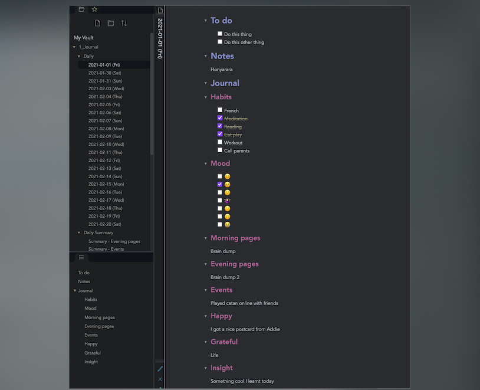
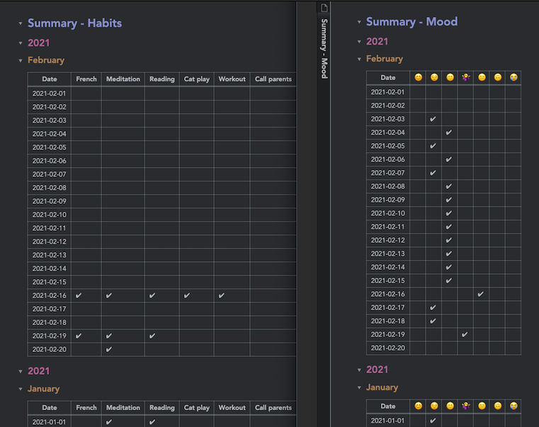
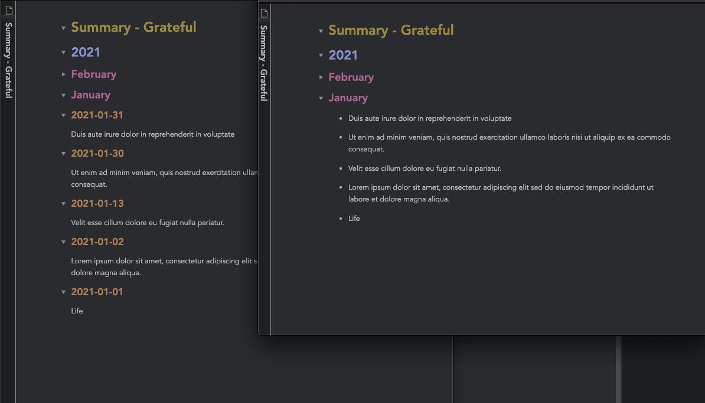
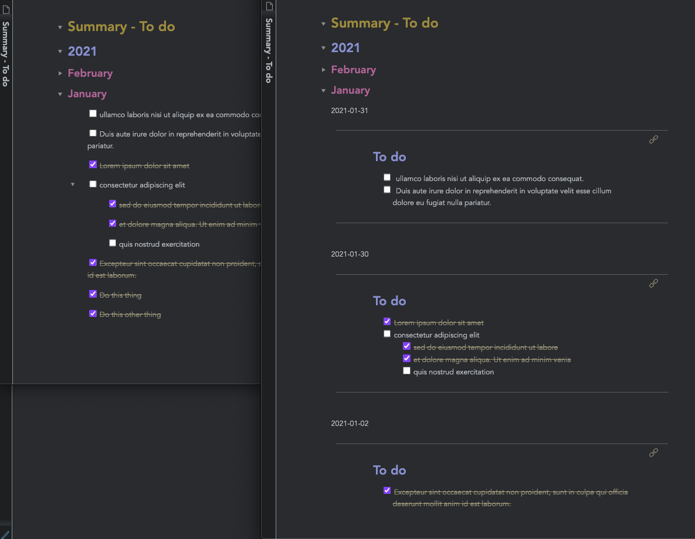

## Obsidian: Summarise bullet journal style daily entries

Python scripts to generate summary pages from historical daily notes by entries under headers (`generate_header_summary.py`) and generate a table to summarise tracked habits from daily notes (`generate_habit_table.py`).

### How to use

Python 3.7
1. Install dependencies `pip install numpy markdownify Tomark`
2. Edit settings at the top of the .py script
3. Run script e.g. `python generate_header_summary.py`
4. Summary notes should appear automatically in Obsidian under specified folder

### Notes

- Some available options: display options for dates vs bullet points, option to display entries as links/full transclusion as opposed to an unlinked "copy" from dailies. This might be useful if you want to e.g. check a to-do item in summary and have it reflected back on the original daily note. You can turn this off if you just want a summarised diary entry for a more concise view.
- Early prototype for personal use and not tested extensively :)
- Habit tracking only works for checked/unchecked boxes for now
- Known bugs: A bullet point that starts with a #tag will not be displayed correctly with the non-transclusion option

### Demo

If your daily entries are generated from a template with set headers and look something like this:

The scripts generates summary reports:

- Example: Tick boxes from daily notes into monthly tables

- Example: Summary of the 'Grateful' header in dailies, with or without dates

- Example: Simple copied list (left) vs. transclusion (right)

